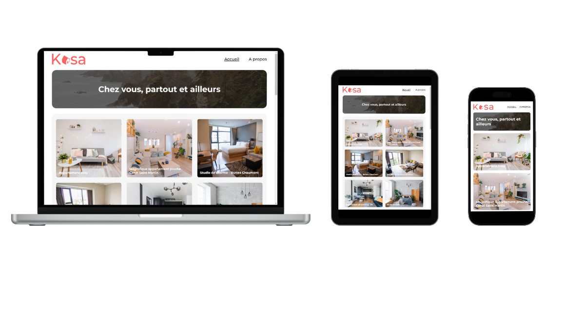

# Kasa - entreprise de location d'appartements entre particuliers

# Présentation du projet

Dans ce projet, j'ai implémenté le front-end d'une application en utlisant React, React Router ainsi que Sass.

# Live demo

Site : https://projet5-oc.vercel.app/

# Aperçu du projet

# Technologies utilisées

<ul>
    <li>HTML 5</li>
    <li>Javascript React</li>
    <li>Sass</li>
</ul>

# Compétences évaluées

<ul>
    <li>Développer une interface web avec Sass</li>
    <li>Configurer la navigation entre les pages de l'application avec React Router</li>
    <li>Développer des éléments de l'interface d'un site web grâce à des composants React</li>
    <li>Mettre en œuvre des animations CSS</li>
    <li>Initialiser une application avec Vite</li>
</ul>

# Dépôt distant

Lien Github : https://github.com/esther57-web/projet5OC.git

# Me contacter

Linkedin : https://www.linkedin.com/in/esther-ossete-kamardine-8115a3277/

# React + Vite

This template provides a minimal setup to get React working in Vite with HMR and some ESLint rules.

Currently, two official plugins are available:

- [@vitejs/plugin-react](https://github.com/vitejs/vite-plugin-react/blob/main/packages/plugin-react/README.md) uses [Babel](https://babeljs.io/) for Fast Refresh
- [@vitejs/plugin-react-swc](https://github.com/vitejs/vite-plugin-react-swc) uses [SWC](https://swc.rs/) for Fast Refresh
